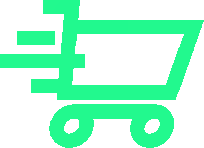
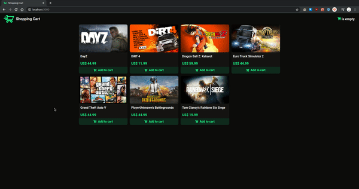

<p align="center"></p>
<h1 align="center">React Shopping Cart</h1>
<p align="center">A shopping cart using React and Redux.</p>

<h1>📸 Preview</h1>
<p align="center"></p>
<h2 align="center"><a href="https://keeqler-react-shopping-cart.herokuapp.com/">🔥 Click to access demo 🔥</a></h2>

<h1>🚀 What I used</h1>

- Javascript
- [NodeJS](https://nodejs.org)
- [ReactJS](https://reactjs.org)
- [Redux](https://redux.js.org)
- [Redux Saga](https://redux-saga.js.org)
- [Styled Components](https://styled-components.com)

<h1>🎉 Running</h1>

### ⚠️ Requirements

- [NodeJS](https://nodejs.org)
- [Yarn](https://yarnpkg.com)

### 🔥 Running the React app

Install the dependencies:

```shell
$ yarn
```

Start the React app:

```shell
$ yarn start
```

You will be able to access it in your browser at http://localhost:3000
